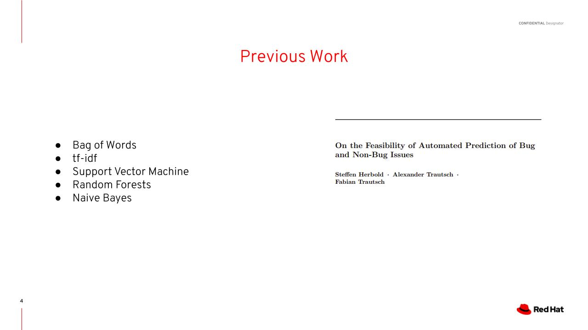
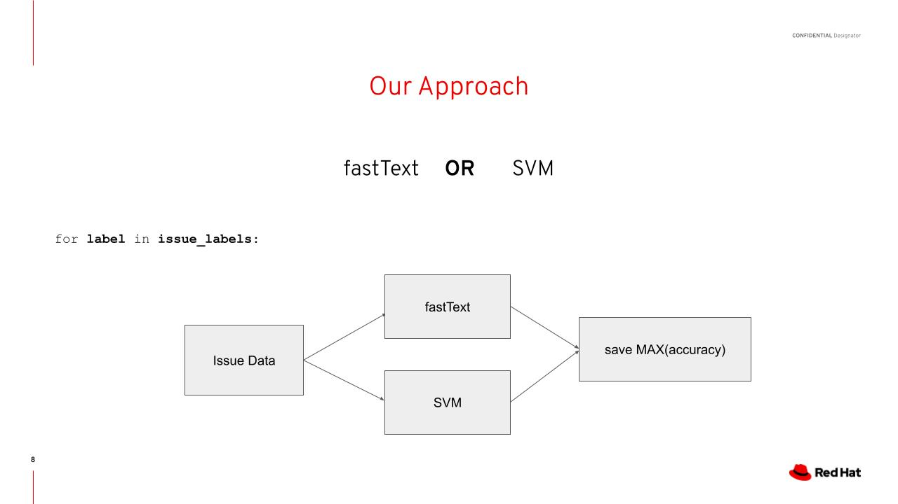

# Background

## Organization of Issue Tracking Systems

Here's what a really pretty
open source repository looks like.

As you can see, every
issue is labeled in some way.
If you're a developer and
you want to work on the demo,
you could just click on `kind/demo` and
see what issues are associated with the
demo. If the demo is
important to fix before next week, your issues are organized so you
could easily find and fix your specific issues with the demo.

But what usually happens in open
source repositories is this:

Since it's just regular people
contributing they will not tag the issues, either because they
don't really know which tag is the proper tag to use, or because they
just don't feel like it.

The goal of our project is to alleviate this problem by creating an automatic issue labeler that will tag issues using AI instead of expecting random contibutors to do it themselves.

## Previous Work

There's been a
lot of work in this direction.

In that [paper](https://arxiv.org/abs/2003.05357) shown on the right, the authors basically conducted a survey of the field, tried out some new methods, and talked about the accuracy of user-tagged labels as well. They tried all sorts of basic NLP problems, such as tf-idf, SVMs, and other acronyms. They found that SVMs work well, but a newer word vector model known as fastText actually achieved the best results on their datasets. SVMs and fastText will make up the basis of our approach, which we will get into later.

However, there was a major issue in the previous work. Namely, it only classified three labels: bug, feature, and question. In reality, for any given open source repo, there will be a much longer list of labels, many of which are likely more useful than simply bug, feature, or question.

The reason that the previous work in this field only worked on labelling bug, feature, question is that their approach was different than what we want to build for our purposes. They wanted to make a generalizable model that could work on any github repository without needing to be trained again every time. Almost every repository contains the issue tags bug, feature, and question, and so they had plenty of consistent data to work with to make a generalizable model.

We wanted our approach to be different. Instead of creating a single, generalizable model, we wanted to create personalized models specific to the repositories they would be trained on. We wanted it to be possible to predict more than three labels.

## Our Method

 The obvious drawback to our method is that we would have way less data to work with, only individual repos instead of all issues. So while their method is generalizable and more accurate for the labels they can predict, we hope our method will be more useful to open source repository managers.

We will now discuss our model choice. We use a mixture of SVM's and pretrained fastText models.

fastText is a word vector model, meaning every word in the model's vocabulary has an n-dimensional vector associated with it. With proper training, words that are similar to one another would have vectors that are close to each other in n-dimensional space. When training a fastText classifier, the model uses stochastic gradient descent to find a linear layer that best fits the dataset. One of fastText's main benefits is that it can be pre-trained on a larger dataset, which we will use. The model can read wikipedia, for example, and get a good starting alignment of word vectors. Since fastText is a powerful model that can have a very large vocabulary and large vector space corresponding to it, it requires a lot of training data, something we do not always have.

This is where SVMs come in. They use a more classical statistical learning algorithm and can get very good results on small datasets. The main difference is that fastText can understand some of the nuances of the English language by knowing synonyms and related parts of speech, while SVMs are good at identifying keywords that come up that can give the label away.

How are two models used? First, it is important to discuss binary classification. For each label in our dataset, we will have a separate model. That is, if we had 10 labels, we would want 10 models that can output `YES` or `NO`. To get the predicted labels for an issue, we run the issue through the 10 models and return the labels which had a `YES` label outputted. We do this to solve the problem of certain labels dominating the dataset, and the problem of being able to apply multiple tags to one issue.

For each tag we create the label dataset, by taking the issues that are labelled with that tag and randomly selecting issues that don't contain the tag. We then train both fastText and an SVM on that dataset and see which one performs better. We save the model that has better results.

Now we can go through the actual code to see how it works.
